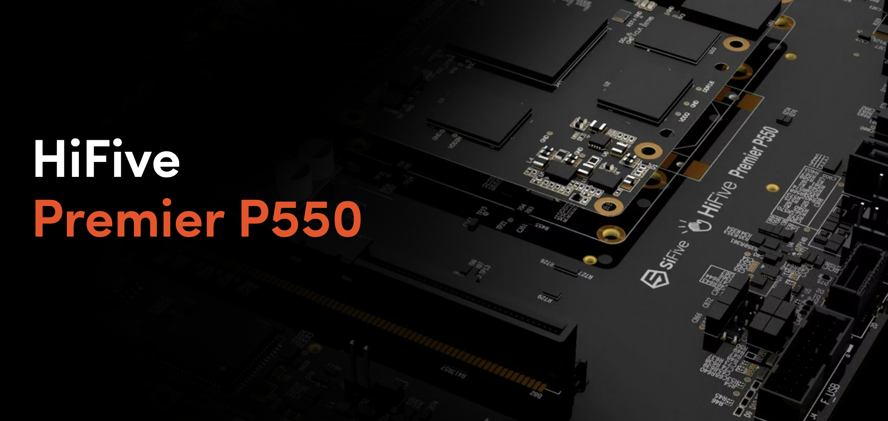

This is an example page for the SiFive HiFive P550 Board

Add relevant information: 

## Required Details (directly recreate)
	- Distro Download Link (where to get the OS)
	- Getting Started Link / Docs Link
	- Pinout Diagram
	- Firmware Download Links
	- Linux Kernel Version Supported
	- RISC-V Profile
	- Board name
	- Manufacturer Name
	- CPU 
	- SoC / SBC / Packaging
	- Maintinance Status (based on updates in the past 12 months)

## Suggested Details (Directly recreate, or link to externally)
	- Form Factor
	- Memory
	- CPU Speed
	- GPU
	- Driver Support
	- PCI Bus Speed
	- Memory Type (DRAM / ETC)
	- Storage boot options (N2/ NVME / SSD/..etc)
	- Power Spec (min/max wattage), Power Type (USB-C, ...etc)